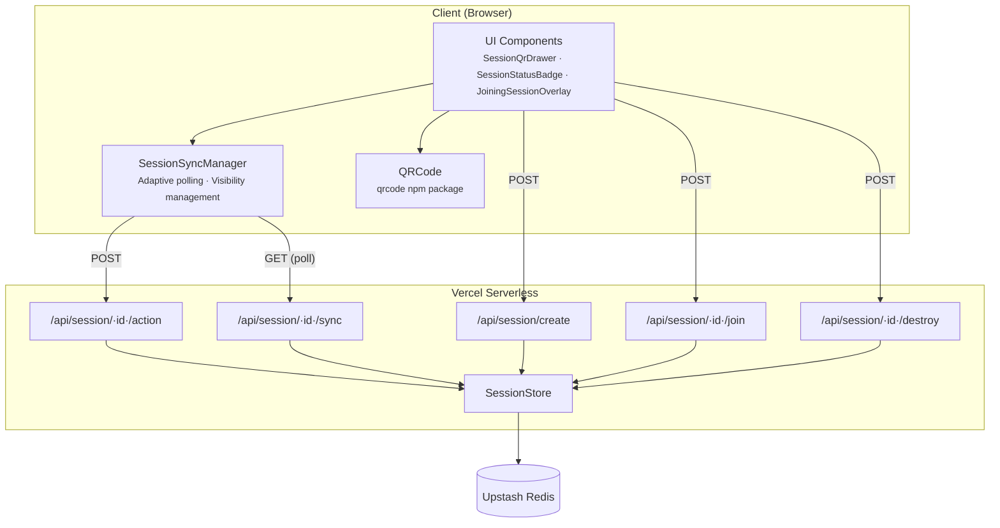
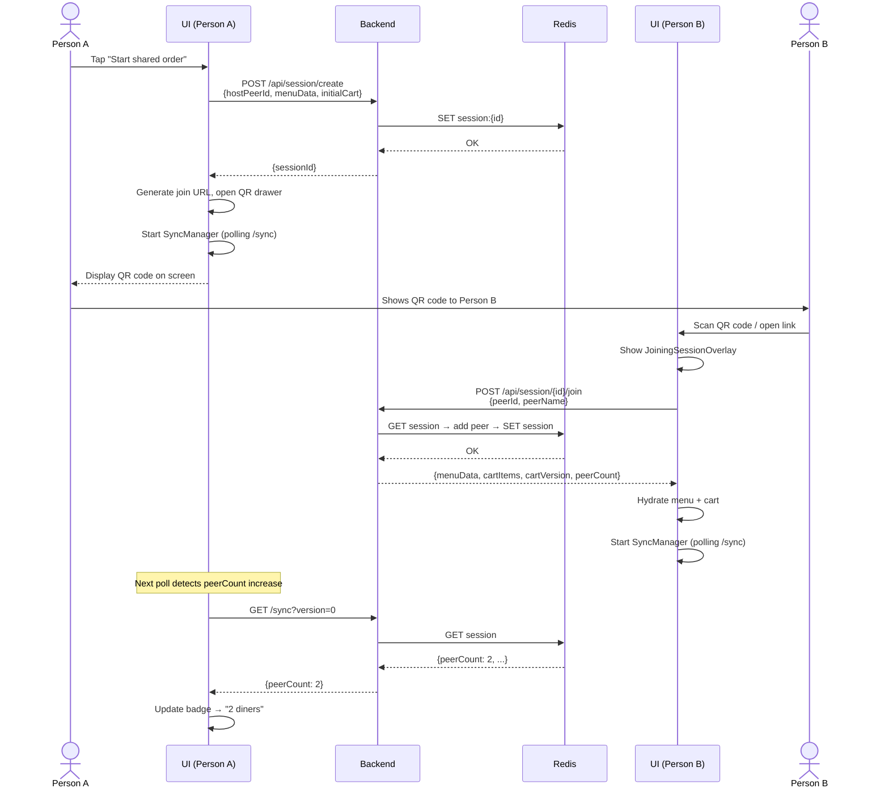
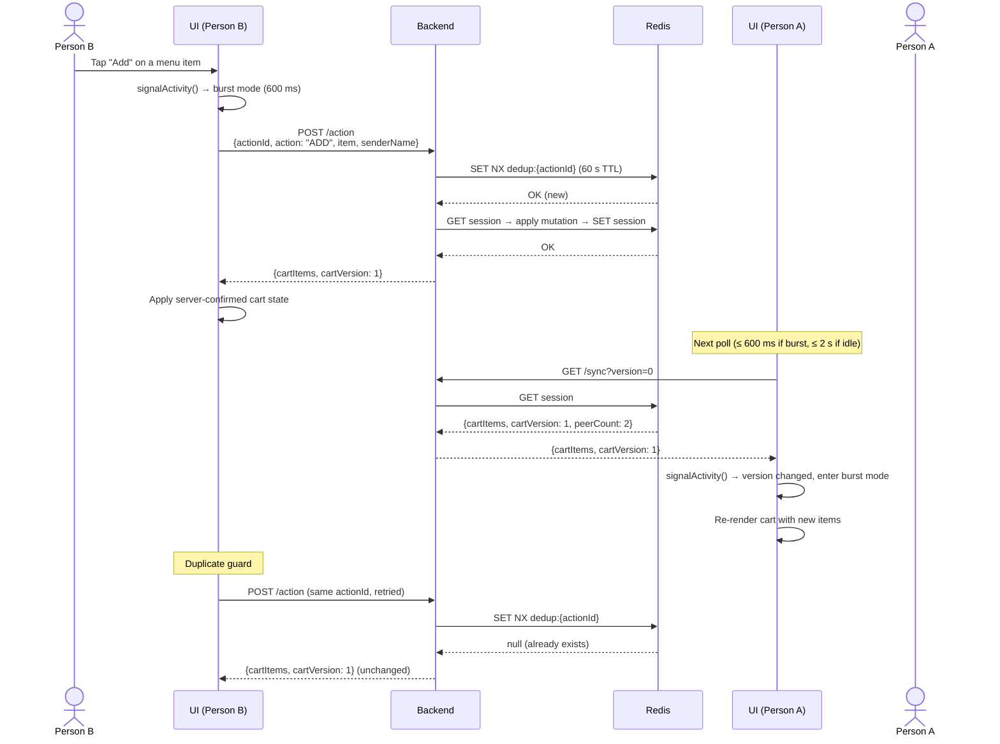
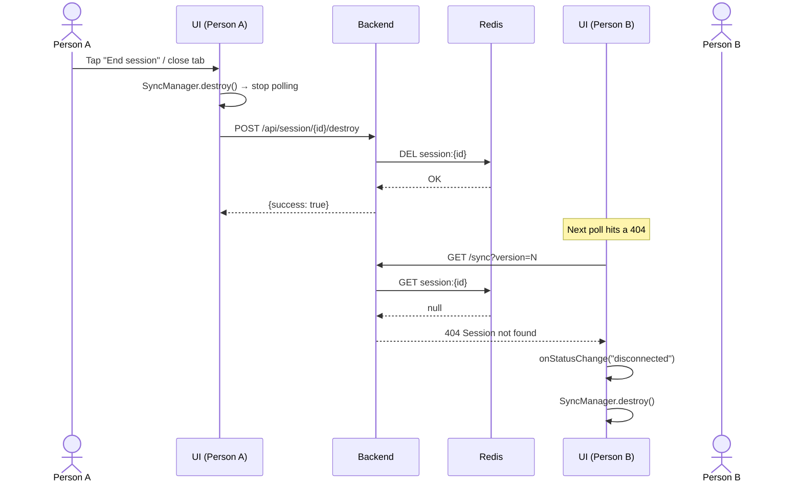

# Collaborative Ordering

Real-time, multi-user shared cart for co-located diners. One person scans the menu, starts a session, and others join by scanning a QR code or opening a link. Every participant can add or remove items from a single shared cart that stays synchronised across all devices.

---

## Architecture Overview

---

## Component Layers

### UI Components

| File | Purpose |
|------|---------|
| `SessionQrDrawer.tsx` | Bottom drawer displaying the QR code, room code pill, copy-link button, and live diner count. Opened by the host after session creation. |
| `SessionStatusBadge.tsx` | Pill-shaped badge showing connection status (colour-coded) and peer count. Tapping it re-opens the QR drawer. |
| `JoiningSessionOverlay.tsx` | Full-screen overlay shown to guests while joining — animated loading state and error state with retry. |
| `QRCode` (`components/ui/qr-code.tsx`) | Renders a QR code via the `qrcode` npm package. Accepts a URL string and renders a retina-resolution ``. |

### Sync Manager

| File | Purpose |
|------|---------|
| `session-sync-manager.ts` | Single class used by **both** host and guest. Polls `GET /sync` for authoritative cart state and submits mutations via `POST /action`. Implements adaptive polling (600 ms active / 2 s idle) and page-visibility pausing. |

### API Routes

| Route | Method | Purpose |
|-------|--------|---------|
| `/api/session/create` | POST | Creates a new session in Redis. Returns the session ID. |
| `/api/session/[id]/join` | POST | Registers a guest peer, returns full session state (menu + cart) for immediate hydration. |
| `/api/session/[id]/action` | POST | Receives a `CartActionMessage`, applies it **atomically** in Redis, returns updated cart. |
| `/api/session/[id]/sync` | GET | Returns current cart state + peer presence. Clients poll this at interval. |
| `/api/session/[id]/destroy` | POST | Deletes the session from Redis. |

### Session Store

| File | Purpose |
|------|---------|
| `session-store.ts` | Server-side Redis wrapper. Manages session CRUD, atomic cart mutations (`applyCartAction` with `actionId`-based deduplication via `SET NX`), and presence-aware sync reads (`getCartSync`). |

### Types

| File | Purpose |
|------|---------|
| `types/session.ts` | Shared type definitions: `CartActionMessage`, `CartSyncMessage`, `PeerPresenceMessage`, `SessionRole`, `SessionConnectionStatus`. |

---

## Sequence Diagrams

### 1. Session Creation + Guest Join

### 2. Cart Action Flow

### 3. Session Teardown

---

## Design Decisions

### Server-authoritative over peer-to-peer

Cart mutations are applied atomically in Redis by the API route handler, not by a client-side "host" browser. This eliminates the host as a single point of failure — if Person A closes their tab, the session and cart persist in Redis for all other participants. It also avoids the need for conflict resolution (CRDTs, last-write-wins) since the server serialises all writes.

### Polling over WebSockets

The application is deployed on Vercel serverless, which has no persistent process to maintain WebSocket connections. Polling `GET /sync` at adaptive intervals (600 ms–2 s) provides adequate latency for a food-ordering UX while remaining fully compatible with serverless infrastructure. Page-visibility pausing ensures zero wasted requests when the tab is backgrounded.

### Single SyncManager for both roles

Host and guest interact identically with the server: both `POST /action` to mutate the cart and `GET /sync` to poll state. The only behavioural difference is session lifecycle (host calls `/create` and `/destroy`, guest calls `/join`). A single `SessionSyncManager` class avoids duplicated logic and makes both roles easy to reason about.

### Action deduplication

Every `CartActionMessage` carries a unique `actionId` (UUID). The server uses Redis `SET NX` with a 60-second TTL to ensure each action is applied at most once. If a client retries a failed request or a duplicate arrives via a race condition, the server returns the current cart state without re-applying the mutation.
